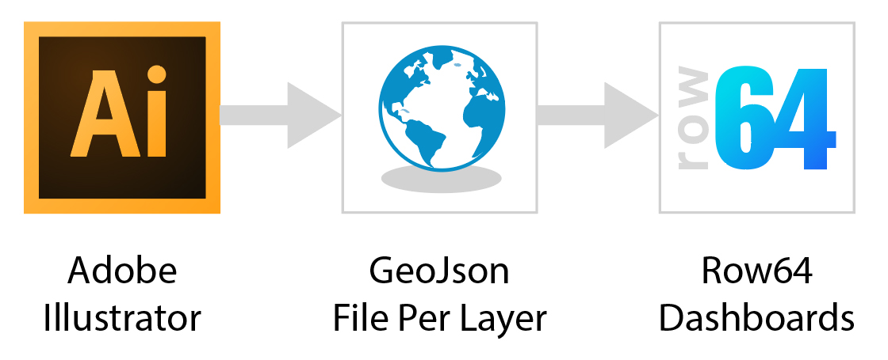
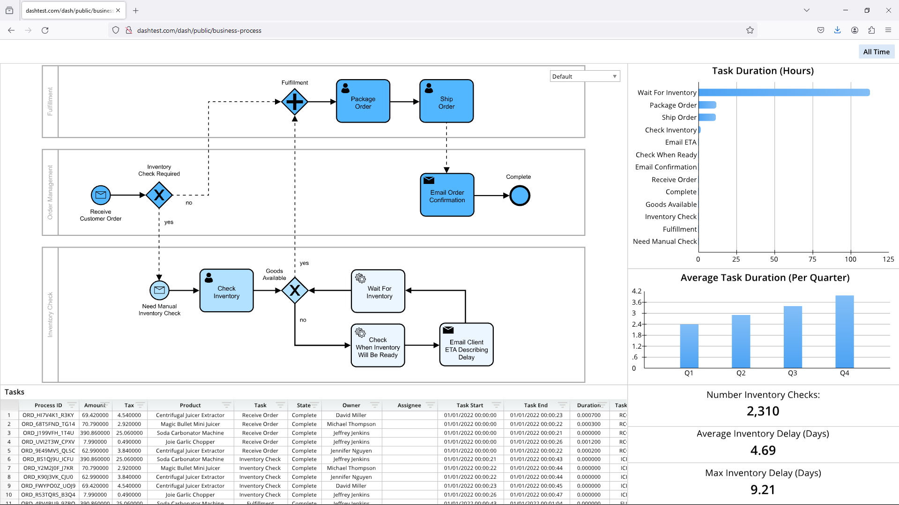
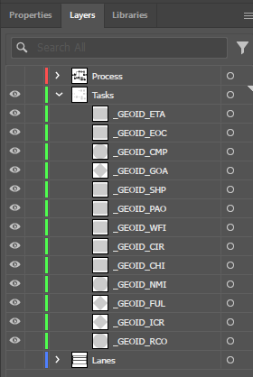

 

 

## Export GeoJson From Illustrator

This script is designed to export lines and filled shapes from Adobe Illustrator to the GeoJson Format.

It's designed as a workflow to get diagrams and custom maps into Row64 dashboards.
An example is this business process dashboard:

It was exported as 3 seperate .json layers from Adobe Illustrator using this tool.

It's very powerful for moving any generic map, drawing or diagram into a business dashboard.

A few areas where this could be useful:

  - Business Process Diagrams from BPMN to custom
  - Game Level Analytics
  - Real-Estate maps and land use
  - Facility Management & Architectural Analysis of Buildings
  - Data driven schematics for electronics, vehicles or products

## Features

Current Features:
  - Export visible Illustrator layers.
     - this makes it easy to export layers one by one
  - Curves are sampled into linear steps
     - this prepares it for tesellation in Row64
  - Handles compound paths and shapes with holes in them

 

Current Limitations:
  - Doesn't process groups
     - you need to ungroup your parts before export
  - Text needs to be turned into outlines
     - use "Create Outline" before export
  - Does not consider color or shading information
     - colors are set within Row64 Geo2D layers
     
  

## How to tag GEOID

Shapes in geojson files can include an id value to connect data in Row64.
This exporter has a simple workflow for identifying ID tags.

The script uses the prefix "_GEOID_" to define objects that have an id value.
Whatever name follow that text will be the ID value:

  

* [MIT License](LICENSE.txt)

  
